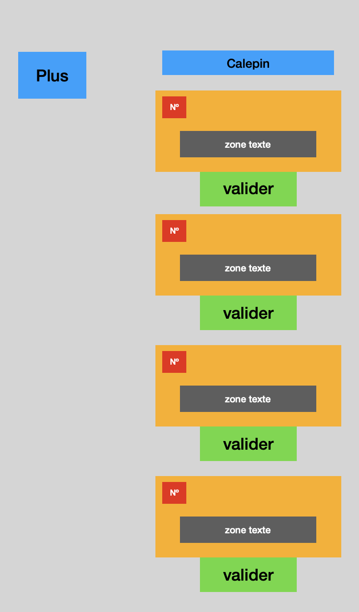
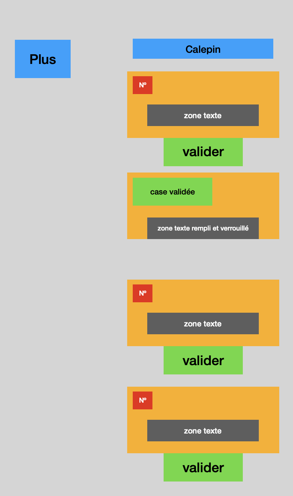
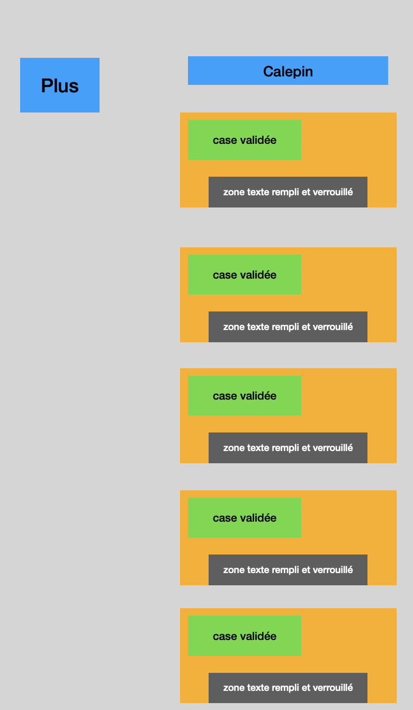
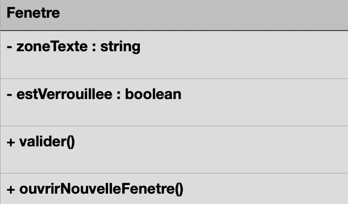

# EXERCICE ANALYSE ET PRODUCTION

Objectif : Analyser et produire une application

## Partie 1 : Analyse

### Les cas d’utilisations

1. L’utilisateur peut s’en servir de bloc de notes
2. Peut servir comme agenda de tâches accomplies ou à accomplir
3. C’est clairement un calepin
4. Pense bête
5. Organisation personnel/professionnel

### Diagramme use case

### Les scénarios nominaux
1. L’utilisateur clique sur « Plus »
2. Un premier volet à compléter s’ouvre
3. L’utilisateur écrit une première tâche
4. L’utilisateur clique sur le bouton « Validate »
5. Le volet se valide en vert, pas de possibilité de modification
6. L’utilisateur peut cliquer sur « Plus » autant de fois qu’il en a besoin mais impossible de revenir en arrière
7. Même processus ainsi de suite

### Diagramme d’activité

### Wireframe

1. Cas 1

2. Cas 2 

3. Cas 3

### Class diagram

### Liste des interventions à moderniser

1. Le raccourcir 
2. Trouver un design plus moderne 
3. Developper les liste à l’horizontal plutôt qu’à la vertical 
4. Faire des cases plus moderne 
5. Mettre plus de 3D 
6. Mettre des noms plus compréhensible 
7. Regrouper certaines lignes de code 
8. Mettre différentes typographies 
9. Optimiser l’espace (bloc vide à gauche qui prend trop de place) 
10. Le bouton valider est en anglais donc l’afficher en français 
11. Ne pas mettre #1 mais nº1 
12. Développer le bouton « Plus », afficher exemple : **« Ajouter une tâche »** 
13. Dans la case vide ou on peut mettre du texte afficher un message grisé « Saisir texte » 
14. Donner la possibilité de revenir en arrière pour modifier une note

Par rapport au code :

1. Renommer les variables, fonctions et objets avec des noms plus explicites.

2. Regrouper certaines portions de code afin d’éviter les répétitions.

3. Structurer davantage le code pour améliorer sa compréhension.

### LIEN DEPÔT
[Lien vers exercice](https://github.com/massaines-cpu/Prairie-In-s-Massa/tree/initiale/AnalyseProduction)
