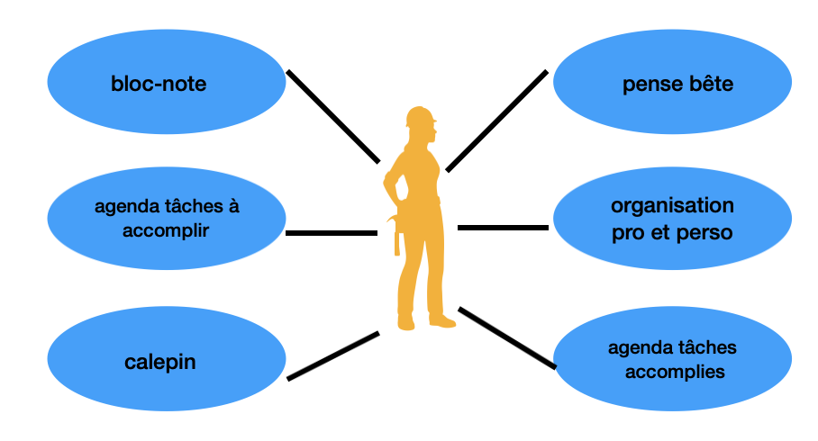
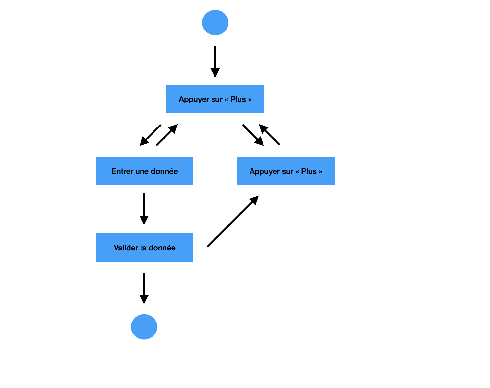

# EXERCICE ANALYSE ET PRODUCTION

Objectif : Analyser et produire une application

## Partie 1 : Analyse

### Les cas d’utilisations

1. L’utilisateur peut s’en servir de bloc de notes
2. Peut servir comme agenda de tâches accomplies ou à accomplir
3. C’est clairement un calepin
4. Pense bête
5. Organisation personnel/professionnel

### Diagramme use case

### Les scénarios nominaux
1. L’utilisateur clique sur « Plus »
2. Un premier volet à compléter s’ouvre
3. L’utilisateur écrit une première tâche
4. L’utilisateur clique sur le bouton « Validate »
5. Le volet se valide en vert, pas de possibilité de modification
6. L’utilisateur peut cliquer sur « Plus » autant de fois qu’il en a besoin mais impossible de revenir en arrière
7. Même processus ainsi de suite

### Diagramme d’activité

### LIEN DEPÔT
[Lien vers exercice](https://github.com/massaines-cpu/Prairie-In-s-Massa/tree/initiale/AnalyseProduction)
