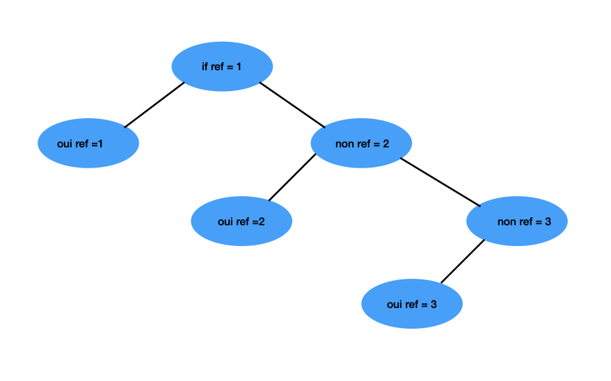

# [Exercice Asch Expérience crash out en 4DX](index.md)

Objectif : Créer un arbre de décision pour l’expérience de Asch et un burn-out

## Ce qui a été abordé

- Introduction aux bibliothèques Pandas, Numpy, Sklearn, Matplotlib
- Définir des fonctions qui vont être liées à notre code final, DP strategy ?
- Remise en question massive de ma vie

## Arbre décisionnel


## Résumé 
1. generate(n) = crée les données aléatoires 
2. solve(line) = donne la réponse correcte pour une ligne 
3. solveDf(df) = remplit la colonne v avec toutes les réponses correctes
4. On entraîne un arbre de décision sur ces données 
5. On teste l’arbre et on calcule le pourcentage de bonnes réponses
6. On sauvegarde le modèle pour l’utiliser plus tard
## Création du tableau
```python
import random
import pandas as pd #pour faire des tb

def generate(n):
    ash_keys = ['a', 'b', 'c', 'd', 'v', '1', '2', '3', 'ref'] #colonne tableau
    df = pd.DataFrame(columns=ash_keys) #création   
                  
    for i in range(n):    #on fait une boucle avec le nombre de bar                                     
        bars = set()         #crée un tableau sans doublon                                
        while len(bars) < 3:     #on doit créer un arbre jusqu'a ce qu'il y en ait 3                              
            bars.add(random.randrange(1, 11)) # crée ensemble de 3 nombres aléatoires entre 1 et 10.
        
        bars = list(bars)       #on converti en list car plus simple                               
        bonne_reponse = random.randrange(1, 3)           #on choisit une barre au hasard   
        ref = bars[bonne_reponse -1]                 #on fait que cette barre soit la ref                  
        choix_des_complices = random.randrange(1, 3) 
                  
        while bars[choix_des_complices -1] == ref:            
            choix_des_complices = random.randrange(1, 3) #on choisit au hasard jusqu'à que ce soit faux
            
        df = pd.concat([df, pd.DataFrame([[   #on ajoute la ligne                 
            choix_des_complices, # a
            choix_des_complices, # b
            choix_des_complices, # c
            choix_des_complices, # d,
            None,                # v
            bars[0],             # 1
            bars[1],             # 2
            bars[2],             # 3
            ref                  # ref
        ]], columns=ash_keys)])

    return df
    
if __name__ == "__main__":
    df = generate(10)
    print(df)

```
# Solve et solveDf
```python
def solve(line):
    if line['1'] == line['ref']: return 1
    if line['2'] == line['ref']: return 2
    return 3
# si la première bar est la référence, renvoie 1
# si la deuxième, renvoie 2
# si, renvoie 3

def solveDf(df):
    df['v'] = df.apply(solve, axis=1)
    return df
#v aura toujours bonne reponse car on tuilise solve
```

# Code final
```python
from arbre import generate
from numpy import mean
from solver import solve, solveDf
from sklearn import tree
import matplotlib.pyplot as plt

df_train = generate(500)  # 500 pour l'entrainement
df_test = generate(50)   # 50 pour tester
df_test = df_test[['a', 'b', 'c', 'd', '1', '2', '3', 'ref']] # pas besoin de v on le calculera au fur et a mesure

# résoudre (remplir v) pour les lignes entrainement
df_train = solveDf(df_train) 

# séparer in et out
inputs = df_train[['a', 'b', 'c', 'd', '1', '2', '3', 'ref']] #toutes les données necessaires
output = df_train[['v']] #la reponse correcte

# créer l'arbre
arbre = tree.DecisionTreeClassifier()

# entrainer l'arbre
arbre = arbre.fit(inputs, output)

dfTest = generate(1)
print(dfTest)

repArbre = arbre.predict(dfTest[['a', 'b', 'c', 'd', '1', '2', '3', 'ref']])
repSolver = solve(dfTest.loc[0]) #on test larbre et on compare avec la reponse correcte (fournie par solve)

print(repArbre, repSolver)

#calcul pourcentage bonne réponse..........
stat = []
# pour chaque ligne du df de test
for i in range(len(df_test)):
    # récupérer la ligne
    row = df_test.iloc[[i]]
    # faire la prédiction à partir de la ligne (sans v) iloc....
    prediction = arbre.predict(row)
    # faire la prédiction avec le solver
    solution = solve(row.loc[0])
    # stocker 0 (erreur de l'arbre) ou 1 (réussite de l'arbre)
    stat.append(int(prediction[0] == solution))

# affichage des résultats
print("moyenne: ", mean(stat)*100)
pickle.dump(arbre, open("model.pkl", 'wb'))
```
## Lien dépôt
[Lien vers exercice](https://github.com/massaines-cpu/Prairie-Ines-Massa/tree/initiale/octavia)
