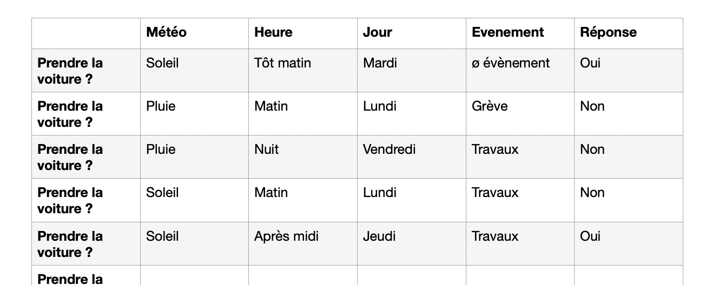

# EXERCICE ARBRE DE DECISION

Objectif : Créer un arbre de décision pour l’expérience de Asch

## Sujet : Prendre la voiture ou non en fonction du trafic
### Modèle des données en entrée et en sortie.
#### Entrée

Definir heures de pointes :
Définir jour :
Météo :
Evenements particuliers (travaux, grève) :

#### Sortie
Prendre la voiture : Oui/Non

### Modèle dataset

## LIEN DEPÔT
[Lien vers exercice]()
